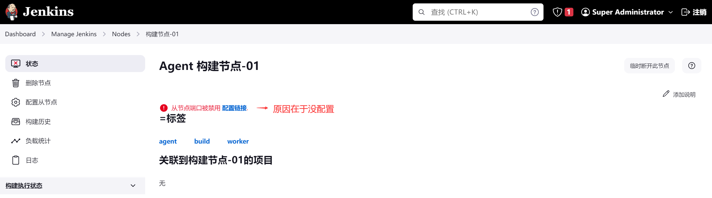
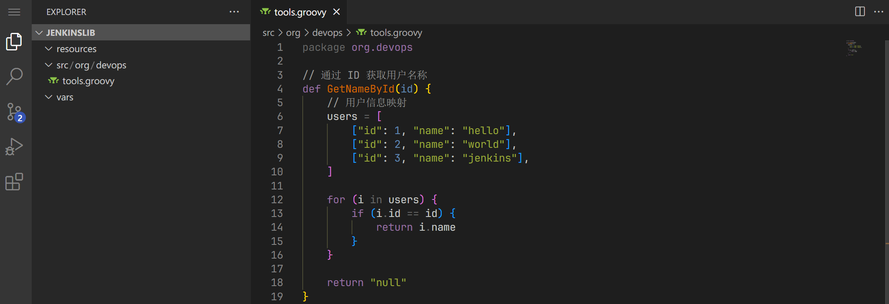

## CI/CD

日常运维中常常听到 CI/CD 这个词，它其实包含整个研发生命周期的三个阶段：

- CI，Continuous integration，持续集成
- CD，Continuous delivery，持续交付
- CD，Continuous deployment，持续部署

大致的流程图如下：


目前主流的 `CI/CD` 工具有很多，比如 `Jenkins`、`Gitlab CI` 以及 `drone` 等等，而 Jenkins 是最常用的。


## Jenkins

Jenkins 是由 Java 开发的一个可扩展的持续集成引擎，前身为 `Hudson`。官网地址为：

> [https://www.jenkins.io](https://www.jenkins.io/)

由于是 Java 开发，那么 Jenkins 的运行就会依赖于 JDK 运行环境。在官方文档中有提到：

> Jenkins requires Java 11 or 17 since Jenkins 2.357 and LTS 2.361.1

注意自己配置的时候选对 JDK 版本。安装 Jenkins 的方式也有很多，常见的有：

- Docker（一般不会单独选择它）
- Kubernetes（在 Kubernetes 环境中可以选择，好处在于高可用）
- Linux rpm（安装简单，但是不方便定制化统一管理）
- Java tomcat（War 或者 jar，用户自定义程度高，管理维护也方便）
- 其它

可以根据自己的需求进行安装，但是需要注意：

> 如果公司项目比较多，构建也很频繁，需要配置较大内存（或者多个 Agent）和较大磁盘空间（会存代码依赖包，可能很大）。

官网中也有提到关于配置方面的内容：

> Minimum hardware requirements:
>
> - 256 MB of RAM
> - 1 GB of drive space (although 10 GB is a recommended minimum if running Jenkins as a Docker container)
>
> Recommended hardware configuration for a small team:
>
> - 4 GB+ of RAM
> - 50 GB+ of drive space
>
> The amount of memory Jenkins needs is largely dependent on many factors, which is why the RAM allotted for it can range from 200 MB for a small installation to 70+ GB for a single and massive Jenkins controller. However, you should be able to estimate the RAM required based on your project build needs.
>
> Each build node connection will take 2-3 threads, which equals about 2 MB or more of memory. You will also need to factor in CPU overhead for Jenkins if there are a lot of users who will be accessing the Jenkins user interface.


## Server 安装（jar）

安装包可以去官网下载，本文使用的是最新稳定版 `2.387.1`：

> https://get.jenkins.io/war-stable/

同时也需要 JDK 11 以上版本

JDK：

> https://www.oracle.com/java/technologies/javase/jdk11-archive-downloads.html

如果想要使用 Tomcat 运行 war，可以看看官网的要求：

> Jenkins requires Servlet API 4.0 (Jakarta EE 8) with `javax.servlet` imports.
>
> Tomcat 9 is based on Servlet API 4.0 (Jakarta EE 8), which is the version of the servlet API required by Jenkins.


安装 JDK：

```bash
# 下载安装包
wget https://download.oracle.com/otn/java/jdk/11.0.2+9/f51449fcd52f4d52b93a989c5c56ed3c/jdk-11.0.2_linux-x64_bin.tar.gz

# 解压安装
tar -zxf jdk-11.0.2_linux-x64_bin.tar.gz 
mkdir -p /opt/service/jdk
mv jdk-11.0.2 /opt/service/jdk/
```

由于这里 Java 没有配置环境变量，后续需要使用绝对路径来执行 java 命令。

这也是在 Jenkins 环境中比较推荐的，因为可能会存在多个 JDK 版本共存的情况，不建议设置环境变量。


安装 Jenkins：

```bash
# 下载安装包
wget https://repo.xxxxxx.com/jenkins/war-stable/2.387.1/jenkins.war

# 安装依赖
yum install fontconfig

# 解压安装
mkdir -p /opt/service/jenkins/{logs,data,backup,bin,server,agent}
mv jenkins.war /opt/service/jenkins/server/
```

配置启动脚本，相关参数可以在官方文档中看到：

> https://www.jenkins.io/doc/book/installing/initial-settings/

其它 Jenkins 本身的启动参数：

> https://www.jenkins.io/doc/book/managing/system-properties/#Featurescontrolledbysystemproperties-PropertiesinJenkinsCore

常用的参数包含以下：

- 数据目录：`-DHUDSON_HOME`
- 时区设置：`-Dorg.apache.commons.jelly.tags.fmt.timeZone=Asia/Shanghai`

脚本内容如下：

```bash
cat > /opt/service/jenkins/bin/start_server.sh << EOF
#!/bin/bash

##############################################################
# 说明：Jenkins 启动脚本
##############################################################

##############################################################
# JDK 相关
##############################################################
# 安装目录
JAVA_HOME="/opt/service/jdk/jdk-11.0.2"
# 启动命令
JAVA="\${JAVA_HOME}/bin/java"

##############################################################
# Jenkins 相关
##############################################################
# 安装目录
JENKINS_BASE_PATH="/opt/service/jenkins"
# 数据目录
JENKINS_HOME="\${JENKINS_BASE_PATH}/data"
# 日志目录
JENKINS_LOG="\${JENKINS_BASE_PATH}/logs"
# Server 目录
JENKINS_SERVER="\${JENKINS_BASE_PATH}/server"
# Agent 目录
JENKINS_AGENT="\${JENKINS_BASE_PATH}/agent"

##############################################################
# 启动参数
##############################################################
\${JAVA} -DHUDSON_HOME="\${JENKINS_HOME}" \\
        -Dorg.apache.commons.jelly.tags.fmt.timeZone=Asia/Shanghai \\
        -jar "\${JENKINS_SERVER}/jenkins.war" > \${JENKINS_LOG}/jenkins-server.log 2>&1 &
EOF
```


修改权限并启动：

```bash
chmod 755 /opt/service/jenkins/bin/start_server.sh
sh /opt/service/jenkins/bin/start_server.sh
```

启动之后在日子中会看到：


这里就是第一次登录的密码，使用安装服务器的 `8080` 端口则可以访问到 Jenkins。


## Server 初始化

启动完成之后就能进行初始化配置了：

1. 使用刚刚日志中的密码解锁 Jenkins：


2. 插件安装，可以后续自己安装，推荐的很多用不到，到时候用一个装一个：


有些时候因为网络的原因，这个页面面能会提示 `离线`，不需要管它，`跳过插件安装` 即可。

只需要安装中文本地插件，用于汉化即可：


安装如图所示：


3. 创建超级管理员用户：


4. 配置 Jenkins 访问地址：


如果有域名就写域名，后续接口访问这些会在页面显示这个地址，如果不修改也没有关系，后面可以通过在系统设置中设置：


5. 安装完成：


6. 修改 Jenkins 保存密码的方式 `Manage Jenkins`：


全局安全设置：


使用 Jenkins 自己的数据库：


一般安装配置完成使用就是这个，如果不是，那么下次登录的时候就会有问题。


7. 中文设置：


设置 Locale：


设置为 `zh_CN` 并忽略浏览器语言。但是 Jenkins 这个汉化比较随意，一般都不彻底。


## Agent 安装（jar）

打开 Jenkins 的管理 Jenkins 菜单，会有这样一个提示：


Jenkins 不推荐直接在 Server 上进行 build，建议按照 agent 来执行构建任务。

这里推荐的也是 agent，毕竟一台机器的性能有限，如果需求很大，可以通过多个 agent 分担压力。


创建 Agent 节点：


添加节点：


详细信息配置：


完成之后可以在左边看到：


查看节点状态：



发现因为启动的时候并没有配置 Agent 通信的节点，所有默认只监听了 Web 访问端口。没有用于 Agent 连接的端口。

可以点击 `配置链接` 进行端口设置（实际就是在全局安全设置下面）：


这里自定义了一个 `12580` 端口。


再次查看节点状态，可以看到已经不一样了：


用过 Kubernetes 的就知道，这个有点像节点加入集群的方法，可以选择第二种安装 agent 的方式。

同时还提供了 agent 的下载地址，此时只需要在一台新的机器上执行相关命令即可，由于我这里测试只有一台机器，所以还是当前机器：

```bash
cd /opt/service/jenkins/agent/
echo ae9baf90e272d7c969f4f264573374eba3ca42666806c45980a071c02b7c8013 > secret-file
curl -sO http://192.168.2.100:8080/jnlpJars/agent.jar
```


添加启动脚本：

```bash
cat > /opt/service/jenkins/bin/start_agent.sh << EOF
#!/bin/bash

##############################################################
# 说明：Jenkins Agent 启动脚本
##############################################################

##############################################################
# JDK 相关
##############################################################
# 安装目录
JAVA_HOME="/opt/service/jdk/jdk-11.0.2"
# 启动命令
JAVA="\${JAVA_HOME}/bin/java"

##############################################################
# Jenkins 相关
##############################################################
# 安装目录
JENKINS_BASE_PATH="/opt/service/jenkins"
# 日志目录
JENKINS_LOG="\${JENKINS_BASE_PATH}/logs"
# Agent 目录
JENKINS_AGENT="\${JENKINS_BASE_PATH}/agent"

##############################################################
# 启动参数
##############################################################
cd ${JENKINS_AGENT}
\${JAVA} -jar agent.jar \\
    -jnlpUrl http://192.168.2.100:8080/manage/computer/%E6%9E%84%E5%BB%BA%E8%8A%82%E7%82%B9%2D01/jenkins-agent.jnlp \\
    -secret @secret-file \\
    -workDir "/devops/jenkins" > \${JENKINS_LOG}/jenkins-agent.log 2>&1 &
EOF
```


启动 agent：

```bash
chmod 755 /opt/service/jenkins/bin/start_agent.sh
sh /opt/service/jenkins/bin/start_agent.sh
```


启动完成之后刷新页面：


## Pipeline

Pipeline 是一套运行在 Jenkins 上的工作流框架，它能将原来独立运行于单个或者多个节点的任务连接起来，实现单个任务难以完成的复杂流程编排和可视化的工作。

关于 Jenkins Pipeline：

- Pipeline 脚本是由 Groovy 语言实现的，但是没必要单独去学习 Groovy。
- Pipeline 支持两种语法：Declarative（声明式）和 Scripted Pipeline（脚本式）。
- Pipeline 有两种创建方法：直接在 Jenkins 的 Web UI 中输入脚本，通过创建一个 `Jenkinsfile` 脚本文件放入项目源码库中使用。
- 一般推荐在 Jenkins 中直接从源代码控制（SCMD）中直接载入 Jenkinsfile Pipeline 这种方法。


在使用之前，需要在 Jenkins 中安装三个插件：

- `Blue Ocean`：相当于 Jenkins 的 Pipeline 流水线主题。
- `Pipeline`：Pipeline 支持的核心插件。
- `Pipeline: Stage View`：用于在传统界面查看 Pipeline Stage。


安装后从侧边栏打开 Blue Ocean 如图所示：


更多关于 Pipeline 的信息可以在官方文档中看到：

> https://www.jenkins.io/doc/book/pipeline/


## 创建 Pipeline

安装 Pipeline 插件之后，再次创建构建就需要选择 `流水线` 方式的构建了：


如图所示：


这是系统提供的 hello world pipeline 示例：

```json
pipeline {
    agent any

    stages {
        stage('Hello') {
            steps {
                echo 'Hello World'
            }
        }
    }
}
```

通过该示例可以发现，Pipeline 核心概念包含三个：

- `agent`：指定执行节点。
- `stages`：声明步骤。
- `steps`：该步骤具体执行的方法。

执行后查看：


如果 Pipeline 存在问题，可以通过左边的 `回放` 进行修改调试，等到没问题之后再复制 Pipeline 到配置里面去。


注意，当项目很多的时候，流水线也会很多。它们大致的信息是一样的，如果后期想要修改某个公共的方法，就需要一个一个的去修改构建项目，很麻烦。所以推荐使用版本仓库 Git 对 Pipeline 文件进行统一管理。


## 声明式语法

声明式语法是 Jenkins Pipeline 内置的方法，它包含系统本身自带的和安装插件之后新增的。

想要使用声明式语法很简单，直接打开 Jenkins 流水线语法生成即可：


用法如图：


其中系统自带的变量也非常重要，这里主要列举几个常用的：

- env：
  - `BRANCH_NAME`：Git 分支名称
  - `TAG_NAME`：标签名称
  - `BUILD_NUMBER`：本次构建的 ID
  - `JOB_NAME`：完整的任务名称，可以是 foo 或者 foo/bar
  - `JOB_BASE_NAME`：精简的任务名称，如果名称是 foo/bar，则值是 bar
  - `NODE_NAME`：执行节点的名称
  - `JENKINS_URL`：访问地址 `http://server:port/`
  - `JOB_URL`：任务地址 `http://server:port/job/foo/`
  - `BUILD_URL`：构建地址 `http://server:port/job/foo/15/`


## 节点选择（agent）

支持在 `pipeline` 和 `stage` 模块中定义，示例：

```go
pipeline {
    // 任意 agent 上面执行
    agent any

    // 在指定标签的 agent 上运行，在 Kubernetes 环境下比较实用
    // agent {
    //     label 'base'
    // }

    // 步骤
    stages {
        stage('节点选择测试') {
            steps {
                echo "Hello World"
            }
        }
    }
}
```


## 变量定义（environment）

支持在 `pipeline` 和 `stage` 模块中定义，示例：

```go
pipeline {
    // 定义全局环境变量，
    environment {
        NAME_GLOBAL = "hello"
        AGE_GLOBAL = "18"
    }
    
    agent any
    stages {
        stage('环境变量测试') {
            // 定义局部环境变量
            environment {
                NAME_LOCAL = "world"
                AGE_LOCAL = "20"
            }

            steps {
                // 输出变量信息，注意，变量使用和 Shell 中一样，单引号则会原样输出
                echo "全局变量：${NAME_GLOBAL}-${AGE_GLOBAL}"
                echo "局部变量：${NAME_LOCAL}-${AGE_LOCAL}"
                // 输出系统变量，在使用的时候也可以使用 ${env.BUILD_NUMBER} 这种形式
                echo "构建ID：${BUILD_NUMBER}"
                echo "任务名称：${JOB_NAME}"
                echo "任务名称简写：${JOB_BASE_NAME}"
                echo "节点名称：${NODE_NAME}"
                echo "Jenkins 地址：${JENKINS_URL}"
                echo "任务地址：${JOB_URL}"
                echo "构建地址：${BUILD_URL}"
            }
        }
    }
}
```


## 参数化构建（parameters）

支持在 `pipeline` 模块中定义，示例：

```go
pipeline {
    // 参数和变量的使用方法类似，但是参数支持更多的类型
    parameters {
        booleanParam defaultValue: true, description: '布尔参数', name: 'BOOL_PARAM'
        choice choices: ['java', 'python', 'golang'], description: '选项参数', name: 'CHOICE_PARAM'
        string defaultValue: 'hello world', description: '字符串参数', name: 'STRING_PARAM', trim: true
    }

    agent any
    stages {
        stage('参数化构建测试') {
            steps {
                // 参数化构建的值调用需要 ${params.xxx} 的方式
                echo "布尔参数：${params.BOOL_PARAM}"
                echo "选项参数：${params.CHOICE_PARAM}"
                echo "字符串参数：${params.STRING_PARAM}"
            }
        }
    }
}
```

在参数化构建第一次执行后，Jenkins 任务会变成参数化构建配置：


## 构建设置（options）

支持在 `pipeline` 模块中定义，示例：

```go
pipeline {
    // 构建设置
    options {
        // 用的比较多的就是 buildDiscarder（丢弃旧的构建）
        buildDiscarder logRotator(artifactDaysToKeepStr: '', artifactNumToKeepStr: '', daysToKeepStr: '7', numToKeepStr: '10')
        disableConcurrentBuilds()
    }
    agent any
    stages {
        stage('构建设置') {
            steps {
                echo "hello world"
            }
        }
    }
}
```


## 构建后续（post）

根据构建结果判断下一步做什么，支持在 `pipeline` 和 `stage` 模块中定义，示例：

```go
pipeline {
    agent any
    stages {
        stage('构建后续') {
            steps {
                echo "hello world"
                sleep 30
            }
        }
    }

    // 该配置类似与其它编程语言的 switch，在 Jenkins 中一般用于发通知
    post {
        // 无论如何都会执行
        always {
            echo "always"
        }
        // 构建终止执行
        aborted {
            echo "aborted"
        }
        // 构建成功执行
        success {
            echo "success"
        }
        // 构建失败执行
        failure {
            echo "failure"
        }
    }
}
```


## 触发构建（triggers）

一般用于配置定时构建，支持在 `pipeline` 模块中定义，示例：

```go
pipeline {
    // 每五分钟触发一次构建
    triggers {
        cron 'H/5 * * * *'
    }

    agent any
    stages {
        stage('触发构建') {
            steps {
                echo "hello world"
            }
        }
    }
}
```


## 用户输入（input）

用的不多，一般不会使用这种方法配置，支持在 `stage` 模块中定义，示例：

```go
pipeline {
    agent any
    stages {
        stage('用户输入') {
            // 用户输入
            input {
                message '请选择想要发布的环境'
                ok '确认'
                // 用于接收执行这个 input 的用户
                submitterParameter 'INPUT_USER'
                parameters {
                    choice choices: ['test', 'dev', 'prod'], description: '发布环境', name: 'ENV_NAME'
                }
            }

            steps {
                echo "执行的用户是：${INPUT_USER}"
            }
        }
    }
}
```


## 根据情况执行（when）

一般在多条件的情况下会使用到它，支持在 `stage` 模块中定义，示例：

```go
pipeline {
    agent any
    stages {
        stage('用户输入') {
            // 用户输入
            input {
                message '请选择想要发布的环境'
                ok '确认'
                parameters {
                    choice choices: ['test', 'dev', 'prod'], description: '发布环境', name: 'ENV_NAME'
                }
            }
            steps {
                echo "hello world"
                // 定义全局变量，让后面使用到它，注意，变量需要括起来
                script {
                    env.ENV_NAME = "${ENV_NAME}"
                }
            }
        }

        stage('生产环境') {
            when {
                environment name: 'ENV_NAME', value: 'prod'
            }
            steps {
                echo "开始发布生产环境"
            }
        }

        stage('其它环境') {
            when {
                anyOf {
                    environment name: 'ENV_NAME', value: 'test'
                    environment name: 'ENV_NAME', value: 'dev'
                }
            }
            steps {
                echo "开始发布其它环境"
            }
        }

        stage('发布完成') {
            steps {
                echo "发布完成"
            }
        }
    }
}
```

以上就是 Jenkins Pipeline 自带的常用声明式语法。


## 其它方法

除此上面自带的方法之外，用户在安装插件之后也会新增一些语法。这些都可以使用 `片段生成器` 直接生成。


其中常用的包含：

- `build`：触发另外一个构建
- `deleteDir`：删除目录
- `dir`：切换目录，然后执行
- `echo`：输出自定义内容
- `error`：手动抛出错误
- `fileExists`：判断文件是否存在
- `git`：用于拉取代代码
- `parallel`：用于并行执行
- `retry`：重试
- `script`：嵌入 Groovy 脚本
- `sh`：执行脚本
- `sleep`：等待时间
- `timeout`：超时时间


## Groovy

Groovy 是一种基于 Java 平台的面向对象语言。在 Jenkins Pipeline 中通常用它来增强 Pipeline 的功能。

详细的语法可以参考：

> https://www.w3cschool.cn/groovy/groovy_overview.html


## 字符串（String）

```go
// 定义全局变量
num = 1
job_name = "Devops-demo-test"

pipeline {
    agent any

    stages {
        stage('字符串类型') {
            steps {
                script {
                    // 输出变量，能够直接使用，不需要 $ 符号
                    println(num)
                    println(job_name)

                    // 定义局部变量并赋值
                    times = num
                    
                    // 想要拼接内容，就需要用到 $ 引用变量
                    println("数字：${times}")

                    // 判断字符串开头结尾
                    println(job_name.startsWith("Dev"))
                    println(job_name.endsWith("test"))

                    // 转换成大小写
                    println(job_name.toUpperCase())
                    println(job_name.toLowerCase())

                    // 获取字符串长度
                    println(job_name.length())
                    println(job_name.size())

                    // 判断是否包含某个值，返回 true 或者 false
                    println(job_name.contains("Dev"))
                    println(job_name.contains("test"))
                }
            }
        }
    }
}
```


## 列表（list）

```go
pipeline {
    agent any

    stages {
        stage('列表类型') {
            steps {
                script {
                    job_name = "Devops-demo-test"

                    // 字符串切割，如果没有 toString 方法，返回的是 [Ljava.lang.String;@4554617c 格式的数据
                    job_list = job_name.split("-").toString()
                    
                    // 打印列表
                    println(job_list)

                    // 自己定义列表
                    languages = ["python", "java", "golang"]

                    // 打印列表
                    println(languages)

                    // 获取列表中的元素
                    println("获取列表中的元素")
                    println(languages[0])
                    println(languages.get(0))

                    // 获取列表长度
                    println("获取列表长度")
                    println(languages.size())

                    // 判断列表是否为空
                    println("判断列表是否为空")
                    println(languages.isEmpty())

                    // 列表排序，会影响原始列表
                    println("列表排序")
                    println(languages.sort())
                    println(languages)

                    // 列表翻转，不会影响原始列表
                    println("列表翻转")
                    println(languages.reverse())
                    println(languages)

                    // 给列表添加元素
                    println("给列表添加元素")
                    languages.add("c")
                    println(languages)

                    // 判断列表是否包含元素
                    println("判断列表是否包含元素")
                    println(languages.contains("c"))

                    // 从列表中删除最后一个元素
                    println("从列表中删除最后一个元素")
                    println(languages.pop())
                    println(languages)

                    // 从列表中删除指定元素
                    println("从列表中删除指定元素")
                    println(languages.remove("python"))
                    println(languages)
                }
            }
        }
    }
}
```


## 映射（Map）

```go
pipeline {
    agent any

    stages {
        stage('Map 映射类型') {
            steps {
                script {
                    userInfo = ["id": 1, "name": "Dylan"]

                    // 输出
                    println(userInfo)

                    // 获取指定 Key 的值
                    println(userInfo["id"])
                    println(userInfo.id)

                    // 给 key 重新赋值
                    userInfo["name"] = "hello"
                    println(userInfo)

                    // 判断是否包含某个 Key
                    println(userInfo.containsKey("name"))

                    // 判断是否包含某个值
                    println(userInfo.containsValue("hello"))

                    // 获取所有 key，生成列表
                    println(userInfo.keySet())

                    // 移除某个 key
                    userInfo.remove("id")
                    println(userInfo)
                }
            }
        }
    }
}
```


## 条件判断（if / switch）

```go
branchName = "test"

pipeline {
    agent any
    stages {
        stage('条件判断') {
            steps {
                script {
                    // if
                    if (branchName == "dev") {
                        println("deploy dev")
                    } else if (branchName == "prod") {
                        println("deploy prod") 
                    } else {
                        println("error") 
                    }

                    // switch
                    switch(branchName) {
                        case "dev":
                            println("deploy dev") 
                            break
                        case "prod":
                            println("deploy prod") 
                            break
                        default:
                            println("error") 
                    }
                }
            }
        }
    }
}
```


## 循环遍历（for/times/while）

```go
pipeline {
    agent any
    stages {
        stage('循环遍历') {
            steps {
                script {
                    users = [
                        ["id": 1, "name": "hello"],
                        ["id": 2, "name": "world"],
                        ["id": 3, "name": "jenkins"]
                    ]

                    names = []

                    // for 循环
                    for (i in users) {
                        println(i.id)
                        println(i.name)
                        // 将数据添加到列表
                        names.add(i.name)
                    }

                    // 打印数据
                    println(names)

                    // times 循环指定次数
                    3.times {
                        println("hello world")
                    }

                    // 获取索引
                    3.times {
                        i->
                        println(i)
                    }

                    // while 循环
                    a = 1
                    while(a < 5) {
                        println("while demo")
                        a++
                    }
                }
            }
        }
    }
}
```


## 异常处理（try/catch/finally）

```go
pipeline {
    agent any
    stages {
        stage('异常处理') {
            steps {
                script {
                    try {
                        println("hello world")
                        // 这里会报错
                        println(hello)
                    } catch(e) {
                        // 打印错误信息
                        println(e)
                        // 抛出异常，会在所以执行完成后抛出
                        error "异常是：${e}"
                    } finally {
                        println("处理完成")
                    }
                }
            }
        }
    }
}
```


## 函数（def）

```go
users = [
    ["id": 1, "name": "hello"],
    ["id": 2, "name": "world"],
    ["id": 3, "name": "jenkins"],
]

pipeline {
    agent any
    stages {
        stage('函数') {
            steps {
                script {
                    // 调用函数
                    name = GetNameById(4)
                    if (name == "null") {
                        println("你所查找的用户不存在")
                    } else {
                        println(name)
                    }
                }
            }
        }
    }
}


// 函数定义
def GetNameById(id)  {
    for (i in users) {
        if (i.id == id) {
            return i.name
        }
    }
    return "null"
}
```


## 共享库

通过使用函数知道了可以在 Pipeline 中将很多公共方法抽离出来复用。但是这样的复用也只是单文件的复用。

这样会存在一个问题，随着功能的增加，这个单文件会越开越大。为了解决这个问题，就需要用到共享库的概念。

使用共享库需要用到 GitLab，由于本文是自己测试，就没用私有化部署的 GitLab，如果是公司产品，一定要注意。


创建一个项目，我这里叫 `jenkinslib`：


README 可以根据自己需求看是否需要。


项目目录结构设计：

```bash
jenkinslib/
├── resources
├── src
│   └── org
│       └── devops
└── vars
```

目录说明：

- `src`：一般用于存放相关方法的包。
- `resources`：一般用于存放资源对象。
- `vars`：一般用于声明一些全局变量。

如图所示：



在 `src/org/devops` 下面定义一个 `tools.groovy` 的文件，该文件属于这个项目的 `org.devops` 包。并在里面定义了一个 `GetNameById` 函数。


此时就需要去 Jenkins 上面配置共享库：


具体配置如下：


注意，凭据需要自己添加自己 GitLab 的账号密码。


在 Pipeline 中使用共享库：

```go
// 指定 jenkins 共享库
@Library("jenkinslib-devops") _

// 初始化
def libtools = new org.devops.tools()

pipeline {
    agent any
    stages {
        stage('使用共享库') {
            steps {
                script {
                    // 调用函数
                    name = libtools.GetNameById(1)
                    println(name)
                }
            }
        }
    }
}
```


## 共享库加载 Resource

Jenkins 提供了读取 resources 下面资源的语法。先在 jenkinslib 项目的 resources 中添加 json 文件：


使用语法生成器加载 Resource：


在 Pipeline 中使用：

```go
@Library("jenkinslib-devops") _

pipeline {
    agent any
    stages {
        stage('使用共享库') {
            steps {
                script {
                    // 使用 resources 中的数据
                    data = libraryResource 'config/data.json'
                    println(data)
                }
            }
        }
    }
}
```

到此，Groovy 的基本用法就是这些。


