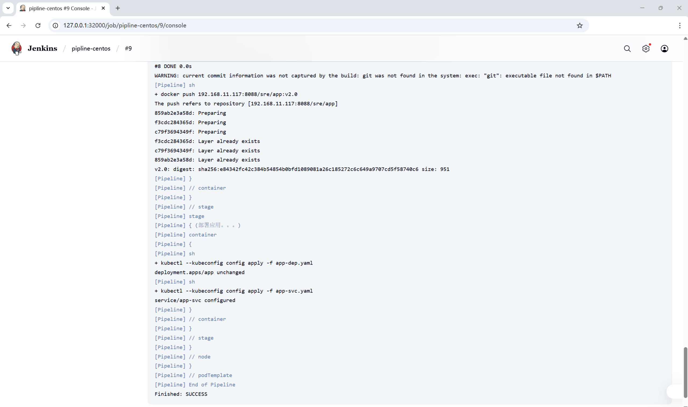

- OAMlab
- https://github.com/oamlab

## 关于部署Jenkins Pipeline演示环境的概要资料 (Overview of deploying Jenkins  Pipeline demo environment)

---

### Jenkins Pipeline

---


图片来源：https://www.jenkins.io/doc/book/resources/pipeline/realworld-pipeline-flow.png

### Kubernetes、GitLab、Jenkins 流水线部署

---

#### 相关软件和版本号

```shell
Centos Stream 9
Kubernetes v1.28.15
cri-dockerd-0.3.8
```

 #### 安装与配置

```shell
[root@gitlab code]# cat /etc/hosts
127.0.0.1   localhost localhost.localdomain localhost4 localhost4.localdomain4
::1         localhost localhost.localdomain localhost6 localhost6.localdomain6
192.168.11.116 gitlab gitlab.test.com
192.168.11.117 harbor
192.168.11.118 k8s
```

---

#### 安装docker和k8s

```shell
##安装docker
yum install -y yum-utils
yum-config-manager --add-repo https://download.docker.com/linux/centos/docker-ce.repo
sed -i 's+https://download.docker.com+https://mirrors.tuna.tsinghua.edu.cn/docker-ce+' /etc/yum.repos.d/docker-ce.repo
yum install docker-ce docker-ce-cli containerd.io docker-buildx-plugin docker-compose-plugin

##安装k8s
[kubernetes]
name=kubernetes
baseurl=https://mirrors4.tuna.tsinghua.edu.cn/kubernetes/yum/repos/kubernetes-el7-$basearch
name=Kubernetes
baseurl=https://mirrors4.tuna.tsinghua.edu.cn/kubernetes/core:/stable:/v1.28/rpm/
enabled=1
gpgcheck=1
gpgkey=https://pkgs.k8s.io/core:/stable:/v1.28/rpm/repodata/repomd.xml.key

##安装k8s
yum install kubelet kubeadm kubectl --disableexcludes=kubernetes

vim /etc/sysconfig/kubelet
# 删除原有内容，添加下面的内容
KUBELET_EXTRA_ARGS="--cgroup-driver=systemd"

##安装cri-docker
wget https://github.com/Mirantis/cri-dockerd/releases/download/v0.3.8/cri-dockerd-0.3.8.amd64.tgz
install -o root -g root -m 0755 cri-dockerd /usr/local/bin/cri-dockerd
install packaging/systemd/* /etc/systemd/system
sed -i -e 's,/usr/bin/cri-dockerd,/usr/local/bin/cri-dockerd,' /etc/systemd/system/cri-docker.service
systemctl daemon-reload
systemctl enable --now cri-docker.socket

##初始化k8s
sudo kubeadm init \
  --apiserver-advertise-address=192.168.11.118 \
  --control-plane-endpoint 192.168.11.118 \
  --kubernetes-version v1.28.15 \
  --service-cidr=10.96.0.0/16 \
  --pod-network-cidr=10.244.0.0/16 \
  --cri-socket unix:///var/run/cri-dockerd.sock 

#部署calico插件
kubectl taint node k8s-192-168-11-118 node-role.kubernetes.io/control-plane:NoSchedule-
curl -O https://docs.projectcalico.org/archive/v3.23/manifests/calico.yaml
kubectl apply -f calico.yaml
```

---

#### 安装gitlab

```shell
#安装gitlab
cat > gitlab-setup.sh << EOF
#!/bin/bash
# 注意：设置 gitlab_shell_ssh_port 是为了后续可以使用 SSH 方式访问你的项目
docker run --detach \\
    --hostname gitlab.test.com \\
    --env GITLAB_OMNIBUS_CONFIG="external_url 'http://gitlab.test.com/'; gitlab_rails['gitlab_shell_ssh_port'] = 6022;" \\
    --publish 443:443 --publish 80:80 --publish 6022:22 \\
    --name gitlab \\
    --restart always \\
    --volume /srv/gitlab/config:/etc/gitlab \\
    --volume /srv/gitlab/logs:/var/log/gitlab \\
    --volume /srv/gitlab/data:/var/opt/gitlab \\
    registry.gitlab.cn/omnibus/gitlab-jh:latest
EOF
---
#获取gitlab初始密码
docker exec -it gitlab grep 'Password:' /etc/gitlab/initial_root_password
```

---

#### 安装harbor

```shell
#安装docker-compose
yum -y install docker-compose

#下载harbor
wget https://github.com/goharbor/harbor/releases/download/v2.6.1/harbor-offline-installer-v2.6.1.tgz
tar xf harbor-offline-installer-v2.6.1.tgz
#配置harbor
cp harbor.yml.tmpl harbor.yml
#修改主机名、端口和注释https后执行sh install.sh
---
hostname: 192.168.11.117
http:
  port: 8088
#https:
  # https port for harbor, default is 443
  #  port: 443
  # The path of cert and key files for nginx
  # certificate: /your/certificate/path
  #private_key: /your/private/key/path
```

#### 安装Jenkins

```
[root@k8s01 jenkins]# cat jenkins-rbac.yaml 
apiVersion: rbac.authorization.k8s.io/v1
kind: ClusterRole
metadata:
  name: jenkins-admin
rules:
- apiGroups: [""]
  resources: ["*"]
  verbs: ["*"]

---
apiVersion: v1
kind: ServiceAccount
metadata:
  name: jenkins-admin
  namespace: devops

---
apiVersion: rbac.authorization.k8s.io/v1
kind: ClusterRoleBinding
metadata:
  name: jenkins-admin
roleRef:
  apiGroup: rbac.authorization.k8s.io
  kind: ClusterRole
  name: jenkins-admin
subjects:
- kind: ServiceAccount
  name: jenkins-admin
  namespace: devops

[root@k8s01 jenkins]# cat jenkins-deploy.yaml 
apiVersion: apps/v1
kind: Deployment
metadata:
  name: jenkins
  namespace: devops
spec:
  replicas: 1
  selector:
    matchLabels:
      app: jenkins-server
  template:
    metadata:
      labels:
        app: jenkins-server
    spec:
      securityContext:
        fsGroup: 0
        runAsUser: 0
      serviceAccountName: jenkins-admin
      dnsPolicy: "ClusterFirst"
      containers:
        - name: jenkins
          image: jenkins/jenkins:lts-jdk17
          resources:
            limits:
              memory: "2Gi"
              cpu: "1000m"
            requests:
              memory: "500Mi"
              cpu: "500m"
          ports:
            - name: httpport
              containerPort: 8080
            - name: jnlpport
              containerPort: 50000
          livenessProbe:
            httpGet:
              path: "/login"
              port: 8080
            initialDelaySeconds: 90
            periodSeconds: 10
            timeoutSeconds: 5
            failureThreshold: 5
          readinessProbe:
            httpGet:
              path: "/login"
              port: 8080
            initialDelaySeconds: 60
            periodSeconds: 10
            timeoutSeconds: 5
            failureThreshold: 3
          volumeMounts:
            - name: jenkins-data
              mountPath: /var/jenkins_home
      volumes:
        - name: jenkins-data
          hostPath: 
            path: /data/jenkins

[root@k8s01 jenkins]# cat jenkins-svc.yaml 
apiVersion: v1
kind: Service
metadata:
  name: jenkins-service
  namespace: devops
  annotations:
    prometheus.io/scrape: 'true'
    prometheus.io/path: '/'
    prometheus.io/port: '8080'
spec:
  selector:
    app: jenkins-server
  type: NodePort
  ports:
    - name: http
      port: 8080
      targetPort: 8080
      nodePort: 32000
    - name: agent
      port: 50000
      targetPort: 50000
      protocol: TCP
```

```shell
#安装插件zh、git、pipeline、kubernetes
#创建凭据
#创建云节点
#https://kubernetes.default.svc.cluster.local
#http://jenkins-service.devops.svc.cluster.local:8080
#jenkins-service.devops.svc.cluster.local:50000
```

### Jenkins流水线部署Go应用程序

---

#### 准备go程序

```shell
#准备go程序
#安装golang环境
wget https://go.dev/dl/go1.24.4.linux-amd64.tar.gz
rm -rf /usr/local/go && tar -C /usr/local -xzf go1.24.4.linux-amd64.tar.gz
export PATH=$PATH:/usr/local/go/bin

#cat code.go
package main
import(
    "fmt"
    "net/http"
)
func helloWorldHandler(w http.ResponseWriter,r *http.Request){
    fmt.Fprintf(w,"Hello World")
}
func main(){
    http.HandleFunc("/",helloWorldHandler)
    http.ListenAndServe(":8080",nil)
}
#
go mod init code
go mod tidy
```

#### 推送go程序到仓库

```shell
#gitlab创建sre群组和go项目
[root@k8s01 go]# git clone http://gitlab.test.com/sre/go.git
[root@k8s01 go]# git config --global user.email "example@example.localhost"
[root@k8s01 go]# git config --global user.user "root"
[root@k8s01 go]# git add *
[root@k8s01 go]# git commit -m "first commit"
[root@k8s01 go]# git push
```

#### go编译环境容器

```shell
#上传基础镜像至harbor
docker pull quay.io/centos/centos:stream9
docker tag quay.io/centos/centos:stream9 192.168.11.117:8088/sre/centos:stream9
docker login -u admin -p Harbor12345 192.168.11.117:8088
docker images
docker push 192.168.11.117:8088/sre/centos:stream9
```

```shell
#go-image
FROM 192.168.11.117:8088/sre/centos:stream9
COPY local.repo /etc/yum.repos.d/local.repo
ENV PATH=$PATH:/usr/local/go/bin
RUN set -ex; \
    yum -y install git tar; \
    git clone http://192.168.11.117/sre/obs.git; \
    cd obs && tar -C /usr/local -xzf go1.24.4.linux-amd64.tar.gz
#docker-image
FROM 192.168.11.117:8088/sre/centos:stream9
COPY docker-ce.repo /etc/yum.repos.d/docker-ce.repo
RUN set -ex; \
    yum -y install docker-ce-cli
#kubectl
FROM 192.168.11.117:8088/sre/centos:stream9
ADD kubectl /usr/bin/kubectl
RUN set -ex; \
   chmod +x /usr/bin/kubectl
#app
FROM 192.168.11.117:8088/sre/centos:stream9
ADD code /app/code
RUN set -ex; \
   chmod +x /app/code
EXPOSE 8080
CMD ["sh","-c","/app/code"]
```

 ```yaml
 #流水线最终版本
pipeline {
    agent {
        kubernetes {
            cloud 'k8s'
            showRawYaml true
            yaml '''
apiVersion: v1
kind: Pod
spec:
  serviceAccount: jenkins-admin
  securityContext:
    runAsUser: 0
  volumes:
  - name: data
    hostPath: 
      path: /var/run/docker.sock
  - name: docker-config
    hostPath:
      path: /etc/docker
      type: Directory
  containers:
  - name: go
    image: "192.168.11.117:8088/sre/go:v2.0"
    command:
    - "cat"
    tty: true
  - name: docker
    image: "192.168.11.117:8088/sre/docker:v3.0"
    command:
    - "cat"
    volumeMounts:
    - name: data
      mountPath: /var/run/docker.sock
    tty: true
  - name: kubectl
    image: "192.168.11.117:8088/sre/kubectl:v2.0"
    command:
    - "cat"
    tty: true
'''
        }
    }
    stages {
        stage("获取代码。。。") {
            steps {
                git branch: 'main', credentialsId: 'gitlab', url: 'http://192.168.11.116:8080/sre/code.git'
                sh "ls -l ./"
            }
        }
        stage("执行编译。。。") {
            steps {
                container("go") {
                    sh "export PATH=$PATH:/usr/local/go/bin; go build -o code -buildvcs=false ./"
                    sh "ls -lh ./"
                }
            }
        }
        stage("构建镜像。。。") {
            steps {
                git branch: 'main', credentialsId: 'gitlab', url: 'http://192.168.11.116:8080/sre/app.git'
                container("docker") {
                    sh "docker login -u admin -p Harbor12345 192.168.11.117:8088"
                    sh "ls -lh ./"
                    sh "docker build -t 192.168.11.117:8088/sre/app:v2.0 -f ./Dockerfile ."
                    sh "docker push 192.168.11.117:8088/sre/app:v2.0"
                }
            }
        }
        stage("部署应用。。。") {
            steps {
                container("kubectl") {
                    sh "kubectl --kubeconfig config apply -f app-dep.yaml"
                    sh "kubectl --kubeconfig config apply -f app-svc.yaml"
                }
            }
        }
    }
}

 ```

```shell
[root@k8s-192-168-11-118 ~]# kubectl get pod -A
NAMESPACE     NAME                                         READY   STATUS    RESTARTS      AGE
devops        app-76db65c4cc-l7crb                         1/1     Running   0             14h
devops        jenkins-579779f88f-624pt                     1/1     Running   1 (15h ago)   17h
kube-system   calico-kube-controllers-65b8cdc5c-x8wdz      1/1     Running   3 (15h ago)   18h
kube-system   calico-node-pjq88                            1/1     Running   3 (15h ago)   18h
kube-system   coredns-6554b8b87f-4t2rh                     1/1     Running   3 (15h ago)   19h
kube-system   coredns-6554b8b87f-wlvbv                     1/1     Running   3 (15h ago)   19h
kube-system   etcd-k8s-192-168-11-118                      1/1     Running   4 (15h ago)   19h
kube-system   kube-apiserver-k8s-192-168-11-118            1/1     Running   4 (15h ago)   19h
kube-system   kube-controller-manager-k8s-192-168-11-118   1/1     Running   4 (15h ago)   19h
kube-system   kube-proxy-2btc9                             1/1     Running   4 (15h ago)   19h
kube-system   kube-scheduler-k8s-192-168-11-118            1/1     Running   4 (15h ago)   19h
[root@k8s-192-168-11-118 ~]# curl 127.0.0.1:32002
Hello World[root@k8s-192-168-11-118 ~]# 
```



